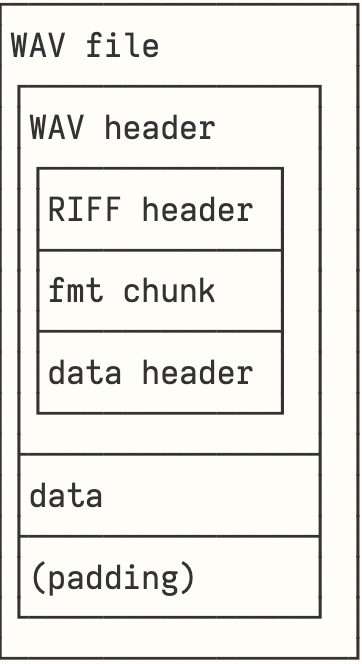
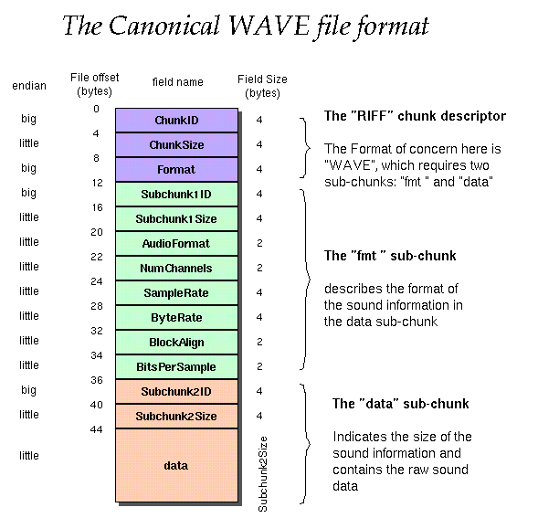

# Wavemaker
Wavemaker is a small library which lets you read and write .wav files from scratch. This library is inspired by the first chapter, [wave](https://mu.krj.st/wave/), of [project μ](https://mu.krj.st/), which was originally written in C.

### Disclaimer
This library currently does not work as a general WAV encoder/decoder. The current implementation is based on the following architecture: 



as compared to the following original structure: 



This architecture slightly simplifies the structure by dividing the data sub-chunk into a seperate header section which is followed by the sample data. In practice, the byte data will be arranged in the same way, but it allows for a clearer structure of the code.  

## Usage
In terms of usage, this library is currently only able to deal with sine waves. It is possible to both write and read sine waves to/from a `.wav` file. 

Furthermore, the currently used formula to generate sine waves is not optimal and comes with a number of practical issues if one would want to further extend the functionality based on this: 

$sine(τ) = sin(2π * ƒτ)$ 
(where ƒ is the frequency of the oscillator and τ is time in seconds)

For more information, refer to the explination in [chapter 2: osc (part 1)](https://mu.krj.st/osc_i/) of [project μ](https://mu.krj.st/).

### Writing a sine to a .wav file
Creating a .wav file can be achieved in just a few lines of code: 

```rust
    // Let's first define the required metadata which will go into the header of our WAV file 
    let config = Config {
        sample_size: SAMPLE_SIZE,
        channels: NCHANNELS,
        sample_rate: SR,
        bits_per_sample: 8 as u16 * SAMPLE_SIZE,
        nsamples: NSAMPLES,
        duration: 5,
    };
    let frequency = 220.0;
    let amplitude = 0.2; 

    // We can then use the config to initialise a new WAV file
    let mut wav = Wave::new(&config);    

    // Let's now create a sine using the frequency and amplitude we defined above  
    wav.write_sine("sine.wav", frequency, amplitude);
``` 

### Reading a .wav file into memory
We can also read the sample data and create a WAVE file struct from it. This allows direct access to the sample data stored in it: 

```rust
    // NOTE: At this point this also requires us to pass in a config which we define ourselves. 
    // Removing this necessity is a task for a future refactor
    let wav = read("sine.wav", &config); 
    
    // We can now read the associated sample data directly from the struct field
    wav.read_data();
```

### Building an executable
We can easily build an executable using `cargo`: 

```
cargo build --target-dir bin/ 
```

and then execute it, writing the output to a text file: 

```
bin/debug/wavemaker > samples.txt
```

